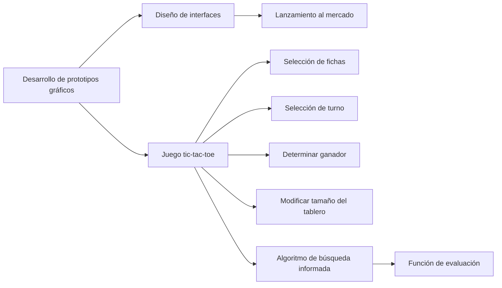

```mermaid
graph LR

A[Desarrollo de prototipos gráficos]
B[Diseño de interfaces]
C[Lanzamiento al mercado]
D[Juego tic-tac-toe]
E[Selección de fichas]
F[Selección de turno]
G[Determinar ganador]
H[Modificar tamaño del tablero]
I[Algoritmo de búsqueda informada]
J[Función de evaluación]

A --> B
B --> C
A --> D
D --> E
D --> F
D --> G
D --> H
D --> I
I --> J
```